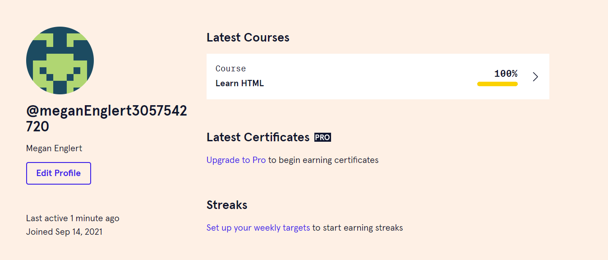

# CISC275 Portfolio
Megan Englert, menglert@udel.edu

[GitHub Repo Here!](https://github.com/meganenglert/CISC275)

## Installed VSCode, Node, and Typescript
I used [this tutorial](https://neu-se.github.io/CS4530-CS5500-Spring-2021/tutorials/week1-getting-started) to get it done. I also followed their instructions to make my first little [TypeScript program](https://github.com/meganenglert/CISC275/blob/master/hello-world.ts)!

*Reflection*: Other than a setting I had to change to be able to use TypeScript, this whole installation process went very smoothly. I really like VSCode! It's really intuitive in my opinion.

*Skills Practiced*: Visual Studio Code, TypeScript

## Added a kanban board to my portfolio repository

I was poking around on all of the tabs for my repository on GitHub and came across the `Projects` tab. I will use [this kanban board on my portfolio repository](https://github.com/meganenglert/CISC275/projects/1) to keep track of my TODOs. 

*Reflection*: This seems like a great built-in tool, especially for working in groups. It's really nice that it's within GitHub, rather than trying to have multiple websites to track.

*Skills Practiced*: Git

## Made my first website - "HTML Notes"

I found [html.com](https://html.com/) through Google and saw that they had a great page on some basic definitions and tags. My uncreative mind defaulted to using a [new HTML website](https://meganenglert.github.io/CISC275/first-website) to take notes on... HTML. I included an unordered list, a definition list, anchor tags, an image (a terrible picture of my guinea pig), a table, and some other tags that apply to text.

*Reflection*: Honestly, HTML is way easier than I thought it would be. It was a bit overwhelming to see all the tags used in class, especially with their different attributes, but I actually had the time to digest how the tags work. In writing this reflection, I also found it way easier to talk about my experience now that I know the "tag"/"attribute" terminology. It also took me a bit to figure out where the link to the webpage would actually be in GitHub Pages, so I learned a bit about that too!

*Skills Practiced*: Basics of the Web - HTML, Deploying with GitHub Pages

## Codecademy HTML Tutorial

This tutorial took much longer than I expected it to, but I think it was incredibly helpful in getting me more advanced in HTML.

Some of the new topics taught in this course that were not in the html.com instructions I used before included:

- How to logically divide my document into a `head`, `body`, and different `div`s.
- More complex table options, including the `thead` and `tbody` tags to keep things organized and easier control style, `rowspan` and `colspan` to merge cells together, and `th` to add headings to rows and columns.
- How to use forms to get input from the user! This one is especially helpful for the website I'd like to make (see next portfolio item).

Overall, I really enjoyed this tutorial because it taught conventions and style in addition to what will make the code compile. Coding with good organization in HTML not only helps your collaborators working on the backend, but, as this tutorial taught, it also adds to the accessbility of the final product. It's really interesting how there are some tags that aren't really visible on the resulting page but have such a big effect on those who need screenreaders.
## WhatNow - the meat of this portfolio (hopefully)

This week, I was aggressively scouring the internet to find task management/organization software with all of the functionalities I wanted, when I realized I could probably make it myself. 

I wrote a detailed explanation of the purpose and planned features for this web app in markdown just to get all of my ideas on paper, and you can find that on [the GitHub pages link](https://meganenglert.github.io/WhatNow/) for my [WhatNow repository](https://github.com/meganenglert/WhatNow).

For the sake of this portfolio, here is a summary of the planned features:
- Basic features
    - User interface to add a task and assign its priority
    - Button to randomly select a task, weighted by priority
    - Checkbox to complete a task
- Reach features
    - Database storage to allow for restarting the page without losing everything
    - Custom user tag system for filtering tasks
    - Time field for each task that can be used for filtering or viewing the estimated time needed to complete all tasks in a tag

# Change Log
## Milestone 1:
- Installed VS Code, Node, and TypeScript
- Added a kanban board to my portfolio repository
- Made my first website with HTML, called "HTML Notes"

# TODO
## Milestone 1:
- Try making some CSS changes on my HTML Notes website, including font color changes, background color changes, etc.
- Learn how to make branches using Git (and what branches actually are). I might use this feature to modify my website.
- Create a new website showcasing some cool features of BootStrap

## Milestone 2:
- 